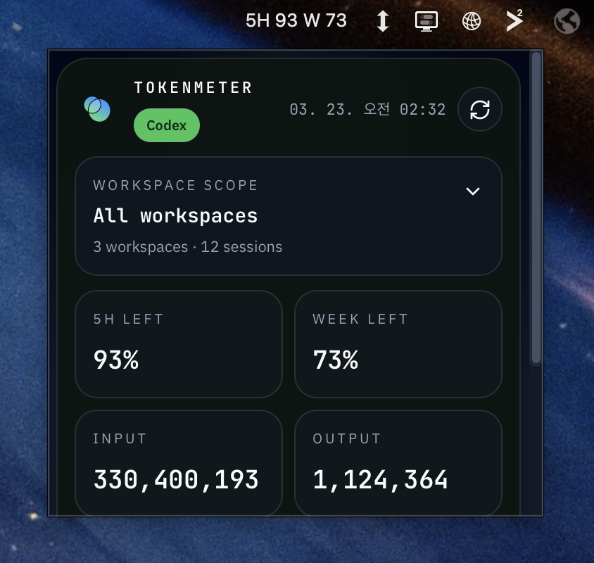
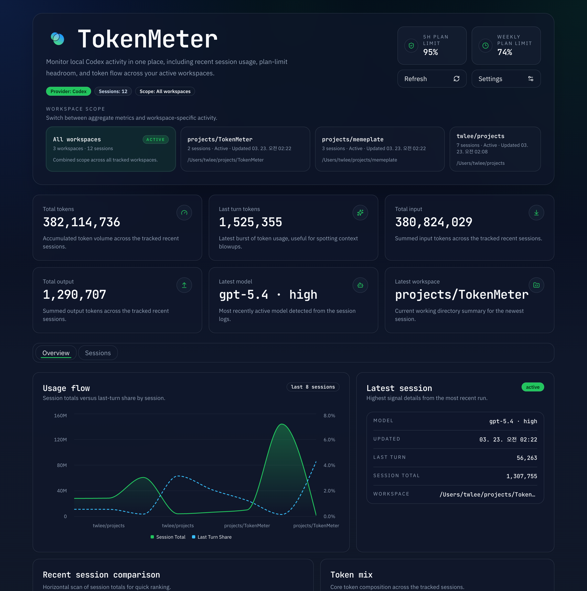

# TokenMeter

TokenMeter is a local-first desktop app for understanding Codex usage on your machine.
It turns local session data into a compact menu bar view and a richer dashboard, so you can see where your sessions are going without sending that data to an external hosted service.

<p align="center">
  
  
</p>

<p align="center">
  Compact menu bar check-ins and a richer desktop dashboard.
</p>

## Why TokenMeter

- See recent Codex activity at a glance from the menu bar
- Open a dashboard with overview cards, charts, and a session ledger
- Filter by workspace to understand where usage is concentrated
- Keep the workflow local-first, with data access and UI running on your machine

## What It Feels Like

TokenMeter is designed as a lightweight developer utility rather than a heavy analytics product.
The compact surface is meant for quick checks. The dashboard is there when you want more context, trends, and session-level detail.

## Requirements

- macOS
- Local Codex usage data on the same machine

## Installation

TokenMeter should be installed as a desktop app.

### Homebrew Tap

```bash
brew tap lteawoo/tokenmeter
brew install --cask tokenmeter
```

To update an existing Homebrew installation:

```bash
brew update
brew upgrade --cask tokenmeter
```

The Homebrew tap lives in `lteawoo/homebrew-tokenmeter`.
The current cask installs the published Apple Silicon macOS build from GitHub Releases.

### OR GitHub Releases Download

Download the latest DMG from GitHub Releases and install TokenMeter directly:

```bash
open https://github.com/lteawoo/TokenMeter/releases/latest
```

Current release artifact:

- `TokenMeter_0.1.8_aarch64.dmg`
- Apple Silicon macOS build

### Build From Source

If you want to run or package the app from this repository, you need:

- `pnpm`
- `Node.js 20+`
- Rust toolchain with `cargo`
- Xcode Command Line Tools on macOS

```bash
pnpm install
pnpm build:desktop
```

This produces the Tauri desktop bundle for TokenMeter.

### Run From Source In Development

```bash
pnpm dev:desktop
```

This starts the local desktop runtime for development.

## Notes

- TokenMeter is a desktop application, not an externally hosted web app
- The browser-based UI path exists to support local development and debugging
- The Homebrew tap repository is `lteawoo/homebrew-tokenmeter`
- Release planning and distribution details live in [docs/release-strategy.md](/Users/twlee/projects/TokenMeter/docs/release-strategy.md)
